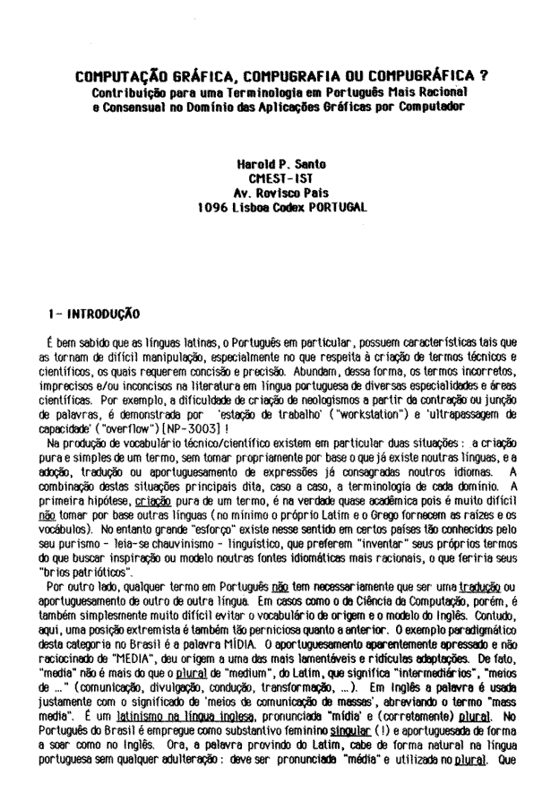

# Computação Gráfica, Compugrafia ou Compugráfica?
**18/08/2026**

Para quem se interessa por etimologia ou quer saber mais sobre as tentativas de se aportuguesar termos técnicos de Computação, leia o artigo [***Computação Gráfica, Compugrafia ou Compugráfica? Contribuição para uma terminologia em Português mais racional e consensual no domínio das aplicações gráficas por computador***](http://sibgrapi.sid.inpe.br/rep/sid.inpe.br/sibgrapi/2012/08.22.01.53), de Harold P. Santo. É um artigo que faz parte dos anais da SIBGRAPI - Conference on Graphics, Patterns and Images, de 1989. Traz curiosidades sobre a língua portuguesa, faz comparações entre Portugal e Brasil e serve como "fotografia" da época.

---
[Voltar à página inicial](index.md)