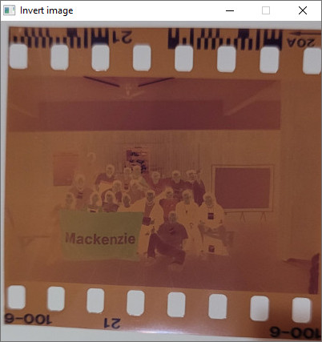
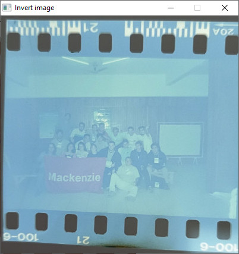

# Transformação de intensidade: Negativo de uma imagem
**31/08/2026**

Na nossa terceira aula, uma das transformações de intensidade que definimos durante as discussões iniciais foi a operação conhecida como negativo de uma imagem, com o cálculo ***S = (L - 1) - E***, sendo:

- ***S***: pixel de saída.

- ***(L - 1)***: intensidade máxima da imagem (no caso de 1 byte para o nível de intensidade, temos ***(L - 1) = 255***).

- ***E***: pixel de entrada.

Comentei que, se você tiver acesso a um filme fotográfico negativo, pode tirar uma foto do filme com o celular e aplicar a transformação acima para "revelar" a foto.

O código abaixo é um trecho do exemplo em C com SDL3 que aplica o negativo da imagem, retirado do material online da disciplina:

Encontrei os negativos de algumas fotos do meu primeiro ano da graduação e resolvi usar um negativo como exemplo:

O resultado do código acima pode ser visto na imagem a seguir:

A imagem transformada não está muito boa (a foto do negativo que tirei com o celular, que é a imagem de entrada, também não ajudou muito...), mas já dá para ver melhor como é a foto: um pessoal da FCI foi de ônibus para Florianópolis/SC em 2002, onde aconteceu o XXII Congresso da Sociedade Brasileira de Computação.

**Deixo a pergunta:** Não dá para ver muitos detalhes na foto revelada porque ela está com baixo contraste... O que podemos fazer para melhorar o resultado?

---
[Voltar à página inicial](index.md)