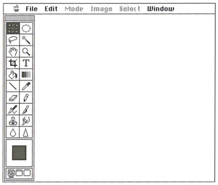

# Código-fonte do Adobe Photoshop 1.0.1
**16/09/2026**

Há 13 anos, o Computer History Musem (CHM) publicou o código-fonte do Adobe Photoshop 1.0.1 (com a permissão da Adobe Systems Inc. e para uso não-comercial).

[O código-fonte, guia do usuário e tutorial do Photoshop podem ser baixados aqui](https://computerhistory.org/blog/adobe-photoshop-source-code/).

Na página do link acima, há também um breve histórico sobre a criação do Photoshop. Interessante saber que a primeira versão foi desenvolvida por uma única pessoa (Thomas Knoll, que era doutorando em Visão Computacional pela Universidade de Michigan) e com a linguagem Pascal e assembly 68000 para o Apple Macintosh.

---
[Voltar à página inicial](index.md)